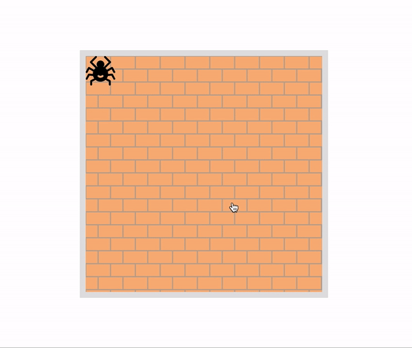

1. Replace `<your_account>` with your Github username in the link
    - [DEMO LINK](https://AlinaMatuschak.github.io/js_task-move-spider-DOM/)
2. Follow [this instructions](https://mate-academy.github.io/layout_task-guideline/)
    - There are no tests for this task so use `npm run lint` command instead of `npm test` 
    
### Task: Move the spider

Move the spider across the wall to a click.

**Requirements:**

- The spider center should come exactly under the pointer on click (without crossing the wall edge).
- The spider must not cross wall boundaries.
When the page is scrolled, nothing should break.

**Notes:**

- The code should also work with different spider and
wall sizes, not be bound to any fixed values.
- Use properties event.clientX/event.clientY for
click coordinates.
- You must only modify the file `src/scripts/main.js`

### Gif of result

